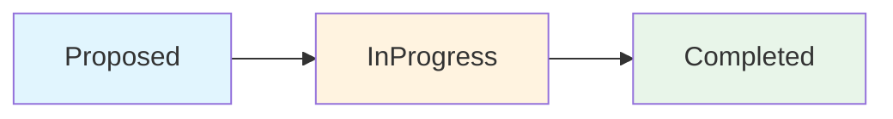
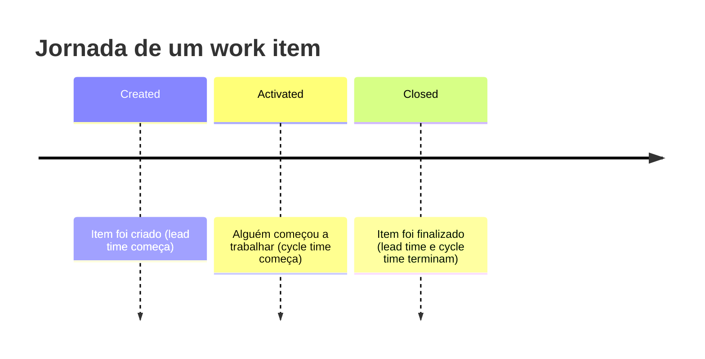

# Conceitos fundamentais

> Público: estagiário de CS (sabe variáveis/loops/funções, nunca viu async/await, OData ou REST).

Este documento explica os conceitos que você precisa entender para usar o `ado-odata-async` com confiança.

---

## O que é OData?

OData (Open Data Protocol) é um padrão que permite consultar dados através de URLs — como se fosse um banco de dados acessível pela web.

**Analogia**: Imagine que o Azure DevOps é um grande arquivo Excel. O OData é como uma "consulta" que você escreve na barra de endereços para buscar só as linhas e colunas que interessam.

Na prática, você monta uma URL com parâmetros especiais:

```
https://analytics.dev.azure.com/minha-org/meu-projeto/_odata/v4.0-preview/WorkItems?$top=10&$select=WorkItemId,Title,State&$filter=WorkItemType eq 'Bug'
```

| Parâmetro | Significado | Exemplo |
|---|---|---|
| `$filter` | Filtra linhas (como WHERE do SQL) | `State eq 'Active'` |
| `$select` | Escolhe colunas (como SELECT) | `WorkItemId,Title` |
| `$top` | Limita resultados | `$top=10` |
| `$orderby` | Ordena | `CreatedDate desc` |
| `$skip` | Pula linhas (para paginação) | `$skip=20` |
| `$expand` | Traz dados relacionados | `$expand=Children` |
| `$apply` | Agrupa e agrega (como GROUP BY) | `groupby((State))/aggregate(...)` |

A biblioteca `ado-odata-async` constrói essas URLs para você usando o `QueryBuilder` — você não precisa se preocupar com a sintaxe exata.

---

## Azure DevOps: WorkItems, WorkItemRevisions e WorkItemSnapshot

O Azure Boards expõe três visões diferentes dos dados. Escolher a certa é essencial.

### WorkItems

É o estado **ATUAL** de cada work item. Uma linha por item.

**Quando usar**: para ver o que está aberto agora, quem está assignado, status atual.

```python
result = await (
    client.query("WorkItems")
    .select("WorkItemId", "Title", "State", "AssignedTo")
    .top(10)
    .get()
)
```

### WorkItemRevisions

É o **histórico completo** de todas as mudanças. Cada vez que alguém edita um work item, uma nova revisão é criada.

**Quando usar**: para auditoria, para saber quem mudou o quê e quando.

```python
result = await (
    client.query("WorkItemRevisions")
    .filter(Filter.eq("WorkItemId", 42))
    .select("WorkItemId", "Title", "RevisedDate", "State")
    .get()
)
```

> **ATENÇÃO**: `$expand=Revisions` **não funciona** no Analytics OData (é bloqueado pelo serviço). Sempre use o entity set `WorkItemRevisions` diretamente.

### WorkItemSnapshot

É uma "fotografia" diária: uma linha por work item por dia. Mostra o estado de cada item no final de cada dia.

**Quando usar**: para calcular métricas de fluxo ao longo do tempo (cycle time, WIP histórico).

> **REGRA**: WorkItemSnapshot **requer** `$apply` com `groupby((DateSK, ...))`. Um `$filter` simples não funciona — o serviço retorna `400 Bad Request`.

```python
from ado_odata_async.query import Apply

result = await (
    client.query("WorkItemSnapshot")
    .apply(
        Apply()
        .filter(Filter.eq("StateCategory", "InProgress"))
        .groupby("DateSK", "State")
        .aggregate("WorkItemId", "countdistinct")
    )
    .top(10)
    .get()
)
```

### Tabela comparativa

| Característica | WorkItems | WorkItemRevisions | WorkItemSnapshot |
|---|---|---|---|
| Uma linha representa | Estado atual de um item | Uma alteração no item | O estado do item em um dia |
| Volume | Pequeno (1 por item) | Grande (muitas por item) | Médio (1 por item por dia) |
| Usado para | Tela "Meus items" | Auditoria de mudanças | Métricas de fluxo |
| Requer `$apply`? | Não | Não | **Sim** (HR-13) |

---

## State vs StateCategory

No Azure Boards, cada work item tem um **State** (estado) que pode ser personalizado pela equipe:

- Estado `Concluído` (PT-BR) / `Done` (inglês)
- Estado `Em Andamento` / `In Progress`
- Estado `A Fazer` / `To Do`

O problema: os nomes mudam conforme o idioma e a customização do projeto.

A solução: **StateCategory** é uma classificação universal que independe do idioma:

| StateCategory | Significado |
|---|---|
| `Proposed` | Item foi criado mas ainda não começou |
| `InProgress` | Item está sendo trabalhado |
| `Completed` | Item foi finalizado |
| `Removed` | Item foi descartado |

**Use StateCategory** nos filtros em vez de State. Exemplo:

```python
# ✅ Correto (funciona em qualquer projeto/idioma)
filter_expr = Filter.eq("StateCategory", "Completed")

# ❌ Frágil (só funciona se o estado exato for 'Concluído')
filter_expr = Filter.eq("State", "Concluído")
```

---

## Paginação (`$top` + @odata.nextLink)

O Azure DevOps limita quantos resultados retorna por consulta (geralmente 200 linhas). Se você precisa de mais, precisa **paginar**.

A biblioteca oferece duas formas de paginar:

### 1. Paginação automática com `paginate()`

```python
async for page in client.paginate("WorkItems", top=100):
    for item in page.get("value", []):
        print(item["WorkItemId"], item["Title"])
```

O `paginate()` cuida de:
- Controlar `$skip` / `$top` automaticamente
- Seguir o link `@odata.nextLink` quando presente
- Parar quando não houver mais dados

### 2. Paginação manual com `$skip` e `$top`

```python
page = 0
while True:
    result = await (
        client.query("WorkItems")
        .select("WorkItemId", "Title")
        .skip(page * 100)
        .top(100)
        .get()
    )
    items = result.get("value", [])
    if not items:
        break
    for item in items:
        print(item["WorkItemId"])
    page += 1
```

---

## Flow metrics em 5 minutos

Flow metrics (métricas de fluxo) medem como o trabalho está fluindo pelo time. São amplamente usadas em Kanban e metodologias ágeis.

### Ciclo de vida de um work item



### Cycle time (tempo de ciclo)

**Definição**: o tempo que um item leva desde que **começou a ser trabalhado** (`ActivatedDate`) até ser **finalizado** (`ClosedDate`).

**O que mede**: a velocidade de entrega do time.

```python
# Exemplo conceitual — veja docs/cookbook.md para o código completo
from datetime import datetime

# ISO 8601: datas UTC vêm com sufixo "Z" — .replace("Z", "+00:00") torna-as legíveis pelo Python
activated = datetime.fromisoformat(item["ActivatedDate"].replace("Z", "+00:00"))
closed = datetime.fromisoformat(item["ClosedDate"].replace("Z", "+00:00"))
cycle_time_days = (closed - activated).total_seconds() / 86400
```

### Lead time (tempo de espera total)

**Definição**: o tempo desde que o item foi **criado** (`CreatedDate`) até ser **finalizado** (`ClosedDate`).

**Diferença para cycle time**: lead time inclui o tempo que o item ficou parado na fila antes de alguém começar a trabalhar.

### Throughput (vazão)

**Definição**: quantos items são finalizados em um período (geralmente por semana).

**O que mede**: a capacidade de entrega do time.

```
Throughput semanal:
  Semana A: 8 items concluídos
  Semana B: 12 items concluídos
  Semana C: 10 items concluídos
```

### WIP — Work In Progress (trabalho em andamento)

**Definição**: quantos items estão em andamento em um dado momento.

**O que mede**: o acúmulo de trabalho. Quanto maior o WIP, mais lento o fluxo.

> WIP (Work In Progress) são os items que estão em estado `InProgress` (ou equivalente local) em um dado momento.

### Diagrama completo



---

## Async/await para quem nunca viu

Se você está acostumado com código sequencial (roda linha 1, depois linha 2, depois linha 3), o `async` pode parecer estranho. Vamos simplificar.

### O problema

Seu código precisa buscar dados na internet. Uma requisição HTTP pode levar de 100ms a 5 segundos. No código **síncrono**, o programa **para** e espera:

```
linha 1: buscar dados (2 segundos de espera... programa travado...)
linha 2: processar dados
```

Durante esses 2 segundos, o programa não faz mais nada. É como ir ao banco e ficar parado na fila sem conseguir fazer mais nada enquanto espera.

### A solução async/await

No código **assíncrono**, enquanto uma tarefa espera (I/O de rede, arquivo, banco), outras tarefas podem rodar:

```
await linha 1: começa a buscar dados  ──┐
                                        │  (2 segundos de espera,
linha 2: processa outro cálculo         │   mas o programa continua)
                                        │
linha 1: resposta chegou! continua   ←──┘
```

**A analogia do banco**: `await` é como pegar uma senha de atendimento. Você entrega a senha e senta — não fica parado em pé na fila. Enquanto seu número não é chamado, você pode ler um livro, responder e-mails, etc. Quando o guichê chama seu número (`await` completa), você volta a andar.

### Regras práticas

1. **`async def`** na frente de uma função significa que ela pode usar `await` dentro.
2. **`await`** na frente de uma chamada significa "espere essa operação terminar, mas não trave o programa — outras coisas podem rodar enquanto isso".
3. **`asyncio.run(main())`** é o ponto de entrada: "rode essa função assíncrona e espere ela terminar".
4. Tudo que usa rede (HTTP, banco) DEVE ser `await` — senão o programa não espera a resposta e quebra.

```python
import asyncio


async def minha_funcao() -> None:
    print("Vou buscar dados...")
    resultado = await alguma_busca_http()  # ← não trava o programa
    print("Dados chegaram:", resultado)


asyncio.run(minha_funcao())
```

> **Dica**: se você esquecer o `await`, o Python retorna um erro como `coroutine was never awaited`. É o sintoma mais comum de quem está começando com async.
